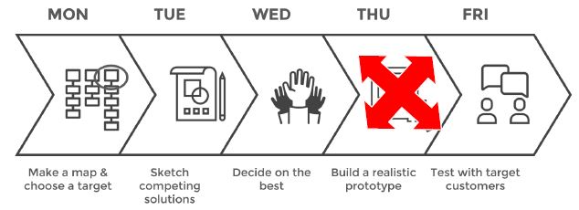

# Task02-Report

<h2>DAY 01 : Discussion of why the app does having problem</h2>

  link video : <a href="https://youtu.be/vfLHEG0bO1I">Discussion of why the app does having problem</a>  
  
  Diskusi ini dilaksanakan pada tanggal 10 September 2020 pada pukul 10.00 
  
  Pada hari pertama, kami melakukan diskusi tentang apa saja kelebihan dan kekurangan pada aplikasi tersebut. Menurut kami, kelebihan dari aplikasi itu sendiri adalah memiliki hirarki menu yang jelas. Di mana saat awal kita buka tersedia main menu, kemudian dilanjutkan dengan beberapa menu sesuai fungsinya masing-masing. Setiap jadwal sholat, memiliki warna untuk membedakan antara sholat yang satu dengan sholat yang lain. Memiliki fitur menentukan arah kiblat yang praktis sehingga pengguna tidak bingung untuk mencari arah kiblat saat sholat.

  Kekurangan dari aplikasi ini adalah saat penggunaan menu “Prayer Journey”. Di menu tersebut, cara kerjanya adalah memencet tanda “note”, setelah itu terdapat 4 simbol yang pemaknaannya perlu dipahami dengan cara membuka menu “Reports” supaya jelas makna dari simbol tersebut.
  
  Setelah itu, kami memutuskan untuk mendesain apa saja yang perlu diperbaiki agar menjadikan aplikasi tersebut lebih sempurna baik menurut kami maupun menurut <i>user</i>

<h2>DAY 02 : Time to Design</h2>
  Momen ini dilaksanakan dari setelah diskusi pertama selesai sampai diskusi kedua dimulai. 
  Link desainnya Ferdy : https://github.com/Group-F-HCI/Assignment-1/tree/hw2/Task02-Report/Team%20F%20Design/Ferdy's%20Design  
  Link desainnya Zhafran <b>(Accepted)</b> : https://github.com/Group-F-HCI/Assignment-1/tree/hw2/Task02-Report/Team%20F%20Design/Zhafran's%20Design  

<h2>DAY 03 : Decide The Best Design</h2>
  link video : <a href="https://youtu.be/4mZ2ipNcCcM">Decide The Best Design</a>  
  Diskusi ini dilaksanakan pada tanggal 11 September 2020 pada pukul 15.05 
  
  Pada hari ketiga, voting desain yang terpilih dilaksanakan. Kami mengundang tiga orang untuk melakukan voting. Ferdy dan Zhafran memberikan rancangan desain mereka dan masing-masing memiliki <i>design principle</i> yang agak berbeda. Setelah pemaparan dari kedua <i>mock up</i>, ada sesi pemilihan <i>mock up</i>. Voting terbanyak jatuh kepada desain kedua.

<h2>DAY 04 : Test with Target Customers</h2>
  Diskusi ini dilaksanakan pada tanggal 11 September 2020 pada pukul 20.00
  
  Setelah penentuan desain, kami memberikan paparan tentang desain yang telah ditentukan. Kami menjelaskan tentang <i>mock up</i> aplikasi tersebut. Kami memberikan penjelasan bahwa desain di setiap komponennya memiliki <i>design principle</i> yaitu , <i>Easy to learn for user and simple</i>. Menurut kami, user akan lebih menyukai suatu hal yang mudah dan simpel. Semua menu yang ada bisa ditekan dengan sekali tekan, kecuali penginputan simbol di menu <i>diary</i>.
